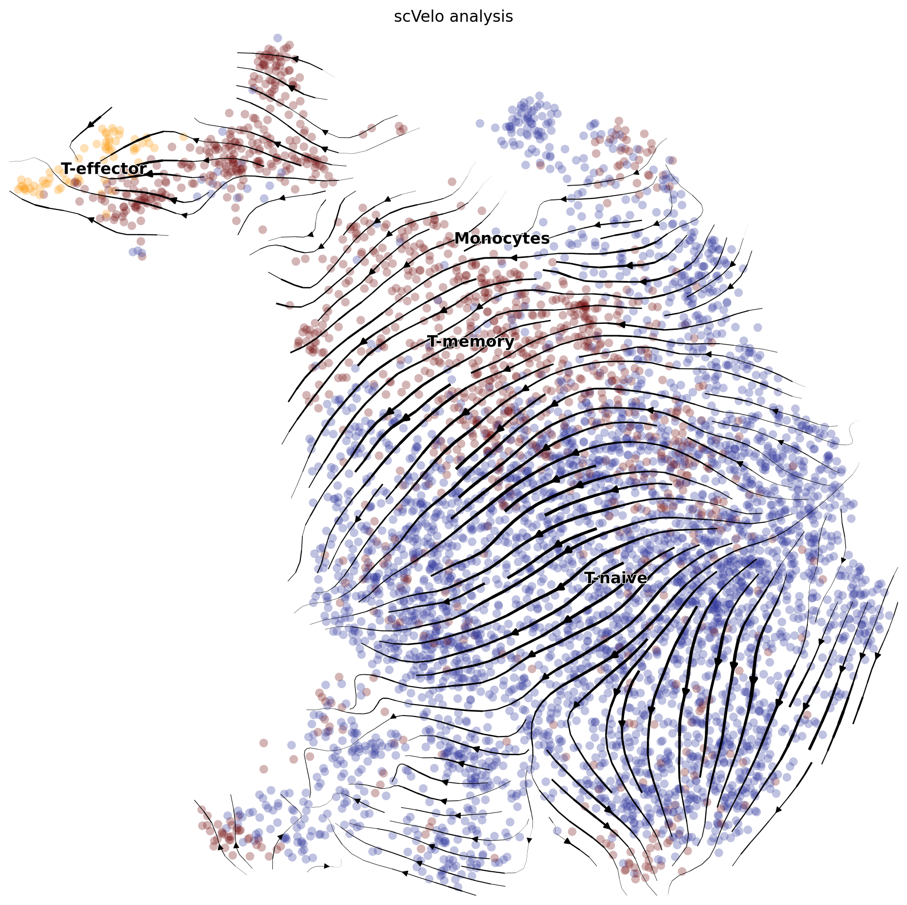

```{r include=FALSE}
knitr::opts_chunk$set(message = FALSE, warning = FALSE, echo = FALSE)
```


\newpage

# Description

Single-cell

# scVelo analysis with dynamical model

> For the details in the estimation of single-cell RNA velocity using dynamical model, refer to the original report[@Bergen2020]: 

> Bergen, V., Lange, M., Peidli, S., Wolf, F. A. & Theis, F. J. Generalizing RNA velocity to transient cell states through dynamical modeling. Nat. Biotechnol. (2020) doi:10.1038/s41587-020-0591-3.

The following codes were used to calculate scRNA velocity and presenting with the existing embedding and labels. 

## For "KO_Hp"

```{python eval=FALSE}
# python below
import scvelo as scv
scv.settings.verbosity = 3  # show errors(0), warnings(1), info(2), hints(3)
scv.settings.presenter_view = True  # set max width size for presenter view
scv.set_figure_params('scvelo')  # for beautified visualization

# load data
ldata_basal = scv.read("./KO_Hp.loom")

# Preprocess the Data
scv.pp.filter_and_normalize(ldata_basal, min_shared_counts=20, n_top_genes=2000)
scv.pp.moments(ldata_basal, n_pcs=30, n_neighbors=30)

# Estimate RNA velocity with dynamical model
scv.tl.recover_dynamics(ldata_basal)
scv.tl.velocity(ldata_basal, mode='dynamical')
scv.tl.velocity_graph(ldata_basal)
scv.pl.velocity_embedding_stream(ldata_basal, basis='umap_cell_embeddings', color='seurat_clusters', 
                                 figsize=(10,10), components='1,2', 
                                 palette=["#2E359A", "#FC990E", "#720D0D"], 
                                 linewidth=1.4, 
                                 title="scVelo analysis", save="KO_Hp.png"
                                )
```


## For "KO_IL4C"


## For "KO_Naive"


## For "WT_Hp"


## For "WT_IL4C"


## For "WT_Naive"



# Session information 
```{r}
sessionInfo()
```

# (References)

