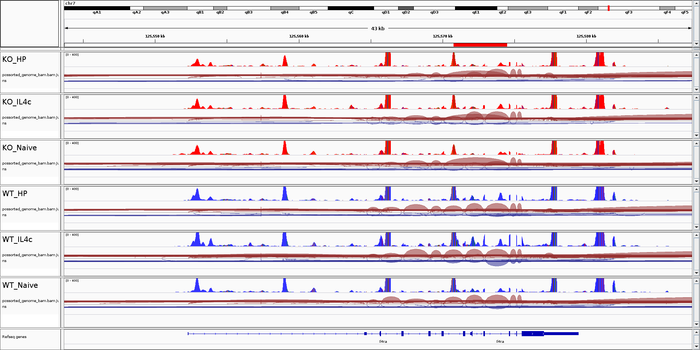
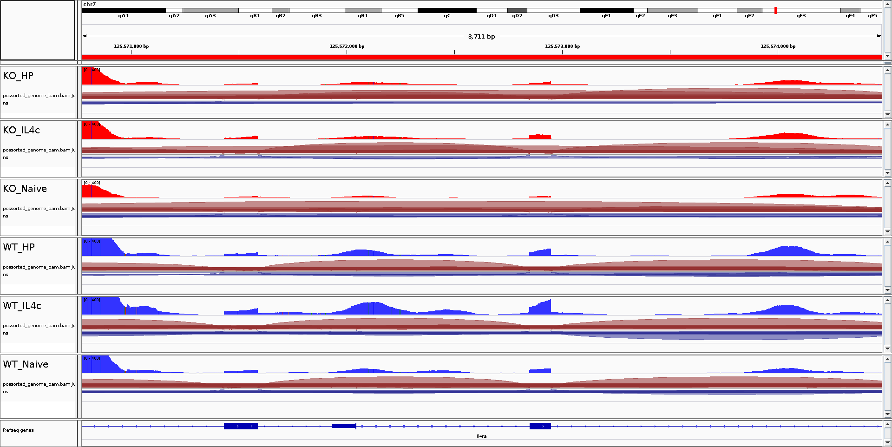

```{r include=FALSE}
knitr::opts_chunk$set(message = FALSE, warning = FALSE)
```


\newpage

# Description

Il4ra-KO cells are less favored for proliferation thus risked to be outcompeted. We should be able to observe difference of read alignment and covering on the Il4ra locus. 


# Alignement of reads in Il4a for all cells

Alignment information in BAM files out of CR outs. 
Find session file in `AllSamples_AllCells.xml`. 

## Alignement of reads in Il4ra locus (from all cells and all samples)



## Alignement of reads in Il4ra exon 7-9 (from all cells and all samples)



*Not only reads cover is lower but also the joints from exon6-7-8-9 were replaced by dominated exon6-9. *

# Subset BAM files by clusters

```{r}
library(Seurat)
load("../../Data/Objects/Zoom.integrated.rds")
so <- Zoom.integrated
DimPlot(so)
```

First check if the barcode sequences can be used as cell names: 

```{r}
table(matrix(unlist(strsplit(colnames(so), split = "_")), nrow = 2)[2, ])
```
*no, some barcodes appeared up to 6 times.*

## separate cellnames by sample and cluser

```{r}
sample.list <- levels(so$Sample)
cluster.list <- levels(so)

meta.cellnames.file <- data.frame() # collect metadata information
for (cluster.name in cluster.list) {
  so.cluster <- subset(so, idents = cluster.name)


  for (x in sample.list) {
  meta.data <- so.cluster[[]]
  cellnames <- rownames(meta.data[meta.data[["Sample"]] == x, ])
  cellnames <- sub(x = cellnames, pattern = "_[0-9]", replacement = "-1" ) # we can change postfixes with 1 because we are sure these cells came from one unique sample. 

  cellnames.file <- paste("cellnames_" , x, "_in_cluster", cluster.name,".cellnameSubset.csv", sep = "")
  write.table(cellnames, file = cellnames.file, row.names = FALSE, col.names = FALSE, quote = FALSE)

  meta.cellnames.file <- rbind(meta.cellnames.file, 
                               data.frame(sample=x, cluster=cluster.name, cellnames.file=cellnames.file))
}
}

meta.cellnames.file$cellnames.file.path <- file.path(getwd(), meta.cellnames.file$cellnames.file)
head(meta.cellnames.file)
```

find the BAM files
```{r}
bam.file.dir <- meta.cellnames.file$sample # the directory is different for each sample
bam.file.dir[bam.file.dir == "WT_Naive"] <- "cDNA-WT-Naive"
bam.file.dir[bam.file.dir == "WT_IL4C"] <- "cDNA-WT-IL4C"
bam.file.dir[bam.file.dir == "WT_Hp"] <- "cDNA-WT-Hp"
bam.file.dir[bam.file.dir == "KO_Naive"] <- "cDNA-KO-Naive"
bam.file.dir[bam.file.dir == "KO_IL4C"] <- "cDNA-KO-IL4C"
bam.file.dir[bam.file.dir == "KO_Hp"] <- "cDNA-KO-Hp"
meta.cellnames.file$bam.file.dir <- bam.file.dir
meta.cellnames.file$bam.file.path <- file.path("/run/user/1001/gvfs/smb-share:server=massstorage.giga.priv,share=u224904/_SHARE_/Research/III/IMMUNOPHYSIO/PLATFORMS/GEN/BDewaels_scRNAseq_CD8_T_cells", bam.file.dir, "outs/possorted_genome_bam.bam")
head(meta.cellnames.file)
```


Prepare data

```{r}
output.dir <- "/mnt/Data/Single-cell_Analysis/Projects/External_Projects/Benjamin_D/Counts/subset_BAM/20211025"
com.subset.list <- character()
com.index.list <- character()
meta.cellnames.file$bam.file.temp.path <- file.path(output.dir, 
                                                    paste0(meta.cellnames.file$sample, ".bam"))
# think about rsync BAM and BAI to local into temp directory to avoid download each time the bam files. 

```

Make BAM subset: 

```{r}
script.subset_bam <- "../../Scripts/20211026_subset_bam.sh"

out.file.list <- character()

for (i in 1:nrow(meta.cellnames.file)) {
  out.file <- file.path(output.dir, sub(x = meta.cellnames.file$cellnames.file[i], pattern = "csv", replacement = "bam"))
  com.subset.arg <- paste( paste0("--bam=",      meta.cellnames.file$bam.file.temp.path[i]), 
                    paste0("--cell-barcodes=",   meta.cellnames.file$cellnames.file.path[i]),
                    paste0("--out-bam=",         out.file), 
                    "--cores=22", 
                    sep = " "
                    )
  out.file.list <- append(out.file.list, out.file)
  com.subset <- paste("subset-bam_linux", com.subset.arg)
  com.subset.list <- append(com.subset.list, com.subset)
  #system(com.subset)
  cat(com.subset, file=script.subset_bam, append = TRUE, sep="\n")
  
  com.index <- paste("samtools index", out.file)
  com.index.list <- append(com.index.list, com.index)
  #system(com.index)
  cat(com.index, file = script.subset_bam, append = TRUE, sep="\n")

}

meta.cellnames.file$subset.bam.file <- basename(out.file.list)
meta.cellnames.file$subset.bam.path <- out.file.list
```
*write lines to a script file is faster, because system() function cannot use all cores we asked. It's better to run script outside R. *

```{bash eval=FALSE}
bash 20211026_subset_bam.sh
```

# Generate attribute table 

```{r}
attribute.table <- data.frame(TRACK_ID=meta.cellnames.file$subset.bam.file, Group=meta.cellnames.file$sample, 
                              Cluster=meta.cellnames.file$cluster, 
                              Genotype=matrix(unlist(strsplit(meta.cellnames.file$sample, split = "_")), nrow = 2)[1,], 
                              Treatment=matrix(unlist(strsplit(meta.cellnames.file$sample, split = "_")), nrow = 2)[2,])
write.table(attribute.table, file = "./attribute_table.txt", quote = FALSE, sep = "\t", row.names = FALSE)
```


# Session information 

Java version

r session

```{r}
sessionInfo()
```


```{bash}
java -version
```

IGV

```
IGV_Linux_2.7.2
```

system
```{bash}
uname -a
```


# References

